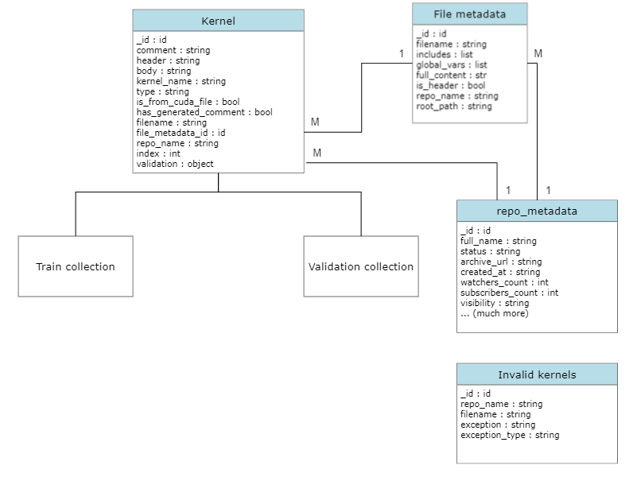

# Code for thesis with the topic
### Code generation from textual description of functionality

## Brief
> This repository containes master thesis practical part and text. The practical part contains scripts for creating new corpora, analysing the newly aquired data and pipelines for training and evaluation of several language models.

## Abstract
> As machine learning and neural network models continue to grow, there is an increasing demand for GPU-accelerated resources and algorithms to support them. Large language models have the potential to assist with this task, as they are already used as coding assistants for popular programming languages. If these models could also learn less commonly used paradigms like CUDA, they could help develop and maintain the necessary systems. This thesis aims to explore the capabilities of modern language models for learning CUDA as a programming paradigm and creating a training corpus specifically for this purpose.¨

!! **Full text in the docs folder** !!

### Project structure
> data 
>> Containes used repositories for this project and folder where the dataset supposed to be stored.

> docs
>> Text of the thesis

> models
>> Storage for evaluated models

> notebooks
>> General notebooks for analysis of the dataset and other.

> src
>> Source code

> test
>> Unit tests

> utils
>> Utility scripts and functions

## Results
> Dataset
>> Created and analyzed corpus of roughly ~500,000 commented CUDA kernels. The dataset is stored in the form of MongoDB collections. Grouped kernel counts by the CUDA prefixes table below.

|         Type         |  Count  |
|:--------------------:|:-------:|
|        device        | 156,027 |
|    device, global    |   180   |
|     device, host     | 182,943 |
| device, host, global |    70   |
|        global        | 128,918 |
|         host         |  17,618 |
|     host, global     |    72   |
|                      |         |
|       **Total**      | 485,828 |

> Models
>> Several trained models with the evaluated results on several language metrics.

|          |  BLEU | Rougle1 prec. | Rouge2 prec. |  BERT | Compile metric |
|:--------:|:-----:|:-------------:|:------------:|:-----:|:--------------:|
| Baseline | 0.063 |     0.013     |     0.02     | 0.037 |      0.037     |
|    T5    | 0.175 |     0.208     |     0.028    | 0.647 |      0.925     |
|   BART   | 0.101 |     0.148     |     0.065    | 0.629 |      0.349     |
|   GPT2   | 0.187 |     0.128     |     0.071    | 0.575 |      0.868     |
|  CodeGen | 0.410 |     0.365     |     0.158    | 0.735 |      0.875     |

## How to run

> The repository contains **requirements.txt** fiile with the used libraries. Besides the used libraries, the code included in this repository requires running MongoDB database on localhost adress with port 27017 with the following structure in the **cuda_snippets** database.

> The individual models' pipelines are implemented in the *src/* folder. These pipelines are similar, but differ in some aspects.